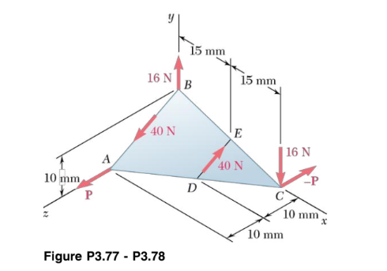

# C3

## <mark style="background-color:$primary;">Chapitre 3 (SUITE)</mark>

### 3.5 Le moment d'un couple

Couple : 2 forces parallèles de grandeur égale et de sens opposé

M→o (Du couple) = M→o (DE F→) + M→o (DE — F→)\
\= r→ob \* F→ + r→oa \* - F→\
\= r→ob \* F→ + r→a \* - F→\
\= (r→ob — r→oa) \* F→

MAIS r→oa + r→ = r→ob\
ALORS r→ob — r→oa = r→

M→o (Du couple) = r→ \* F→ (r→ ; D'un point d'application à l'autre)

On remarque que si la position du O change ; M→couple ne change pas !\
M→ (Du couple) = r→ \* F→ \
(r→ ; D'un point d'application à l'autre) \
(M→ (Du couple) ; Est identique par rapport à n'importe quel point !!)

#### Ex #3.78

<figure><figcaption></figcaption></figure>

Couple 1 ; Les deux forces de 16N

M->couple1 = r->bc \* F->\
\= (0,030mi-> - 0,010mj->) \* 16Nj->\
\= -0,48Nmk->

Couple 2 ; Les deux forces de 20N

M->couple2 = r->ac \* F->\
\= (0,030mi-> - 0,020mk->) \* -20Nk->\
\= + 0,6Nmj->

Couple 3 ; Les deux forces de 40N

M->couple3 = r->db \* F->\
r->db = -0,015mi-> + 0,010mj-> -0,010mk->\
F-> = Fλ->BA\
\= 40Nunitv(\[0, -10, +20]) \
\=-17,89Nj-> + 35,78Nk->

M->couple3 = 0,179Nmi-> + 0,537Nmj-> + 0,268Nmk->

M->couple équivalent = EM->\
\= 0,179Nmi-> 1,137Nmj-> -0,212Nmk->

Mcouple Équiv = norm(\[0.179, 1.137, -0.212])\
1.17Nm

θx = cos-1(0,179/1,17) = 81,2 deg\
θy = cos-1(1,137/1,17) = 81,2 deg\
θz = cos-1(-0,212/1,17) = 81,2 deg

### 3.6 Systèmes Équivalents

Sur un corps rigide, 2 systèmes (1 et 2) de forces et de couples sont équivalents (ont le même effet) si (Ens F->) 1 = (Ens F->) 2 et  (EnsM->o) 1 = (EnsM->o) 2
